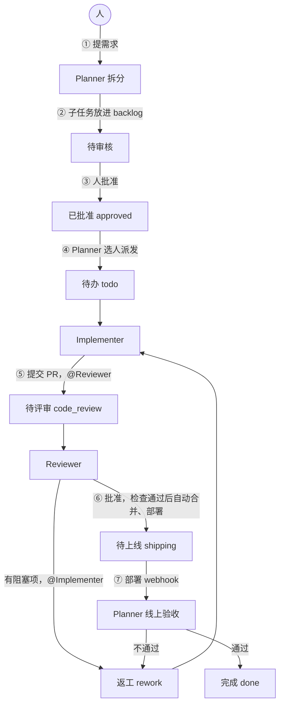

# ai-workflow

让几个编码 agent 按角色分工，自己完成拆需求、写代码、评审、合并、上线和验收，人只负责提需求和批准任务。

这个仓库把这套“自管理 agent 团队”做成了能直接装进你项目的工具：**GitHub 管合并闸门，Multica 管任务调度**。一条命令生成规则文件和角色指令，再用两条命令把 GitHub 规则集、Multica 的状态、agent 和定时任务配好，最后用 `aiwf doctor` 逐项验收。

> 状态：实验性（v0.1）。已在示例项目上端到端跑通（见 [跑通第一个需求](docs/setup/first-run.md)），还没在长期运行的大型项目上验证过，效果要用[每周指标](docs/operations/metrics.md)自己衡量。

## 流程



人在日常流转里只做一件事：把 Planner 拆好的任务从“待审核”改成“已批准”。原来靠人把关的环节，换成了 agent 绕不过去的规则：

| 原来靠人 | 现在靠什么 |
|---|---|
| 看代码 | 另一个账号的 Reviewer + 自动检查 |
| 点合并 | 代码平台的合并规则，所有 agent 都不能豁免 |
| 验收 | Planner 看线上真实结果 |

为什么这样设计，见[为什么要自管理](docs/concepts/why.md)和[四个角色](docs/concepts/roles.md)。

## 快速开始

### 方式一：让你的编码 agent 来装

```bash
npx skills add songhuangcn/ai-workflow --skill ai-workflow
```

然后在项目里对 Claude Code、Codex 等说：“帮我在这个项目里搭好自管理 agent 团队”。skill 会调用下面的 `aiwf`，并完成需要判断的部分：按技术栈写 `make check/dev/deploy`、补 AGENTS.md、和你确认订阅账号后填团队清单。改动 GitHub 和 Multica 之前，它会先给你看预览。

### 方式二：自己跑 aiwf

```bash
git clone https://github.com/songhuangcn/ai-workflow ~/.ai-workflow
cd your-project

~/.ai-workflow/bin/aiwf init --workspace <Multica 工作区 slug>
# 把 Makefile 的 check / dev / deploy 改成真实命令，按你的账号和机器填 ops/agents/registry.yaml
# 提交这些文件，走 PR 合并

~/.ai-workflow/bin/aiwf github            # 预览 GitHub 改动
~/.ai-workflow/bin/aiwf github --apply
~/.ai-workflow/bin/aiwf multica           # 预览 Multica 改动
~/.ai-workflow/bin/aiwf multica --apply
~/.ai-workflow/bin/aiwf doctor            # 逐项检查
```

完整步骤见[快速上手](docs/setup/quickstart.md)。

## 前提条件

| 需要 | 说明 |
|---|---|
| GitHub 仓库 | 你有 admin 权限；`gh` 已登录 |
| `bash`、`git`、`jq`、`curl` | macOS 自带的 bash 3.2 也可以 |
| Multica | CLI 0.5 以上；运行 `aiwf multica` 的人是工作区 owner 或 admin；至少一台机器跑着 daemon，agent CLI 已登录订阅 |
| 机器账号（推荐） | 写代码和评审用不同的 GitHub 账号；没有就先用单账号试用模式 |

GitHub 套餐决定平台闸门能做到什么程度：

| 仓库 | 规则集 + 自动合并 | 合并队列 | aiwf 的保护等级 |
|---|---|---|---|
| 组织的公开仓库 | 有 | 有 | full |
| 个人公开仓库、Pro 私有仓库、Team 组织私有仓库 | 有 | 没有 | standard |
| GitHub Free 的私有仓库 | **没有** | 没有 | none：合并只靠 agent 指令约束 |

详见[安全边界和保护等级](docs/concepts/guardrails.md)。

## 装进你项目的东西

```
AGENTS.md                      追加一个受管块：检查命令、PR 规则、哪些是规则文件
Makefile                       check / dev / deploy（已有就不动，只检查目标）
.jscpd.json                    重复代码阈值
.github/CODEOWNERS             追加受管块：规则文件只能由人批准
.github/workflows/gate.yml     必需检查 check：PR 行数、重复代码、make check
.github/workflows/deploy.yml   合并后部署，结果通知 Planner
.github/workflows/rollback.yml Planner 回滚用
ops/agents/                    配置、团队清单、四个角色指令、8 个 autopilot、三个辅助脚本
```

逐个文件的说明见[生成的文件](docs/reference/files.md)。

## 文档

- 概念：[为什么要自管理](docs/concepts/why.md) · [四个角色](docs/concepts/roles.md) · [任务状态和唤醒](docs/concepts/lifecycle.md) · [按额度选 agent](docs/concepts/quota-routing.md) · [安全边界和保护等级](docs/concepts/guardrails.md)
- 搭建：[前提条件](docs/setup/prerequisites.md) · [快速上手](docs/setup/quickstart.md) · [第 0 步 准备仓库](docs/setup/repo.md) · [第 1–3 步 GitHub](docs/setup/github.md) · [第 4–6 步 Multica](docs/setup/multica.md) · [第 7 步 跑通第一个需求](docs/setup/first-run.md)
- 日常：[日常操作](docs/operations/daily.md) · [每周指标](docs/operations/metrics.md) · [常见问题](docs/operations/troubleshooting.md)
- 参考：[aiwf 命令](docs/reference/cli.md) · [配置文件](docs/reference/config.md) · [生成的文件](docs/reference/files.md) · [代价和风险](docs/limitations.md)

## 和原始设计的差异

这套流程来自《自管理 Agent 团队研究》。落地时按平台现状做了几处调整，都在文档里写了原因：

- **Multica 0.5 改了状态模型**：自定义状态不再继承“进入即唤醒”等行为。所以唤醒下一个角色全部靠显式指派或评论里的 @提及，自定义状态只表示看板上的进度。详见[任务状态和唤醒](docs/concepts/lifecycle.md)。
- **GitHub Free 的私有仓库没有规则集和自动合并**：aiwf 会识别出来并降级：Implementer 不开自动合并（这种仓库里 `gh pr merge --auto` 会立即合并），Reviewer 批准后在检查通过时自己合并，doctor 标出哪些闸门没有生效。
- **个人账号的仓库，协作者不能用 fine-grained token**：机器账号只能用 classic token；想按最小权限给，把仓库放到组织下。
- **每日摘要改用 create_issue 模式**：run_only 的结果只在运行历史里，人收不到通知。

## 开发

```bash
make check   # shellcheck + actionlint + 单元测试；本机没装 linter 时用 docker 镜像
```

维护约定见 [AGENTS.md](AGENTS.md)，版本记录见 [CHANGELOG.md](CHANGELOG.md)。

## 许可

[MIT](LICENSE)
