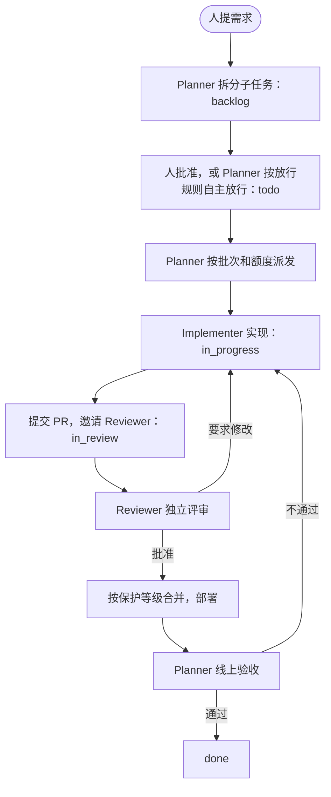

# autoteam

把自管理 agent 团队装进你的项目：Planner 拆需求和验收，Implementer 写代码，Reviewer 独立评审，Auditor 定期复盘；**GitHub 管合并闸门，Multica 管任务调度**。

当前包版本为 **0.1.0**（已发布 tag `v0.1.0`），main 持续开发，包含尚未发布的变更；版本差异与升级说明见 [CHANGELOG](CHANGELOG.md)。[在线文档](https://autoteam-ai.github.io/autoteam/)默认打开开发版（`next`），可切换到发布版本。

## 流程


```mermaid
flowchart TD
    H(["人提需求"]) --> P["Planner 拆分子任务：backlog"]
    P --> A["人批准，或 Planner 按放行规则自主放行：todo"]
    A --> D["Planner 按批次和额度派发"]
    D --> I["Implementer 实现：in_progress"]
    I --> PR["提交 PR，邀请 Reviewer：in_review"]
    PR --> R["Reviewer 独立评审"]
    R -->|"要求修改"| I
    R -->|"批准"| M["按保护等级合并，部署"]
    M --> V["Planner 线上验收"]
    V -->|"通过"| DONE["done"]
    V -->|"不通过"| I
```

人工审批、合并方式和故障升级取决于项目配置与平台能力，见[安全边界和保护等级](https://autoteam-ai.github.io/autoteam/next/concepts/guardrails/)；状态与唤醒规则见[任务生命周期](https://autoteam-ai.github.io/autoteam/next/concepts/lifecycle/)。

## 快速开始

### 让编码 agent 安装

```bash
npx skills add autoteam-ai/autoteam --skill autoteam
```

在目标项目里对编码 agent 说：“帮我在这个项目里搭好自管理 agent 团队”。skill 会协助适配检查、开发和部署命令，配置团队，并预览 GitHub 与 Multica 的改动。

### 手动安装

```bash
git clone https://github.com/autoteam-ai/autoteam ~/.autoteam
cd your-project
bash ~/.autoteam/autoteam init --workspace <工作区-slug>
```

将生成的 `Makefile` 检查、开发、部署目标和工作流改成项目真实命令，填写 `.autoteam/registry.yaml` 与 `.autoteam/autoteam.conf`，审阅并提交生成文件。然后配置外部平台：

```bash
bash ./autoteam github --create-apps         # 预览三个 GitHub App 的创建计划
bash ./autoteam github --create-apps --apply # 浏览器确认创建；随后手动安装到目标仓库
bash ./autoteam setup                       # 一次预览 GitHub 和 Multica，交互确认后执行并运行 doctor
```

已有 App 可跳过创建；非交互终端的 `setup` 只预览，确认计划后运行 `bash ./autoteam setup --apply`。App 私钥需放到对应 agent 的运行机器，完整步骤见[快速上手](https://autoteam-ai.github.io/autoteam/next/setup/quickstart/)与[GitHub 设置](https://autoteam-ai.github.io/autoteam/next/setup/github/)。

## 前提条件

- GitHub 目标仓库的 admin 权限，以及已登录的 `gh`；正式团队使用不同的 Implementer 与 Reviewer App 身份。
- bash 3.2+、git、jq、curl 和 Multica CLI；Windows 使用 WSL。
- Multica 工作区、至少一个在线 daemon，以及已登录订阅账号、能访问仓库的 agent CLI。
- 项目有可重复执行的检查、开发和部署命令，以及清楚的 `AGENTS.md` 约定。

工具版本、权限与运行环境要求见[前提条件](https://autoteam-ai.github.io/autoteam/next/setup/prerequisites/)。

## 文档导航

| 想了解什么 | 入口 |
|---|---|
| 设计与角色分工 | [为什么要自管理](https://autoteam-ai.github.io/autoteam/next/concepts/why/) · [四个角色](https://autoteam-ai.github.io/autoteam/next/concepts/roles/) |
| 安装后跑通一个需求 | [首次运行](https://autoteam-ai.github.io/autoteam/next/setup/first-run/) |
| 日常操作与排障 | [日常操作](https://autoteam-ai.github.io/autoteam/next/operations/daily/) · [常见问题](https://autoteam-ai.github.io/autoteam/next/operations/troubleshooting/) |
| 命令、配置和安装产物 | [命令参考](https://autoteam-ai.github.io/autoteam/next/reference/cli/) · [配置参考](https://autoteam-ai.github.io/autoteam/next/reference/config/) · [生成的文件](https://autoteam-ai.github.io/autoteam/next/reference/files/) |
| 成效与代价 | [运行指标](https://autoteam-ai.github.io/autoteam/next/operations/metrics/) · [代价和风险](https://autoteam-ai.github.io/autoteam/next/limitations/) |

## 开发与许可

本仓库的开发与检查使用 Docker 开发镜像：

```bash
make dev     # 沙盒安装与验证
make check   # 指令预算、shellcheck、actionlint、重复代码与测试
make deploy  # 打包并在干净仓库验证安装
```

文档站本地预览使用 Node.js 22.12+：`npm ci` 后运行 `npm run docs:start`。npm 发版由人执行 `make publish`。维护约定见 [AGENTS.md](AGENTS.md)，许可为 [MIT](LICENSE)。
