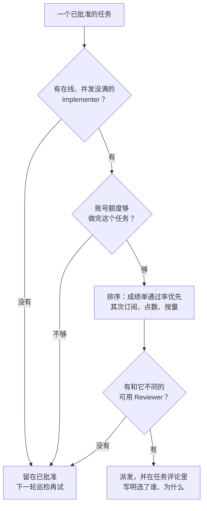

# 按额度选 agent

## 计费模式

| 计费模式 | 额度规则 | 用完后 | 用法 |
|---|---|---|---|
| 订阅窗口制 `subscription` | 滚动时间窗口（比如 5 小时）加每周上限 | 等窗口重置 | 优先用；大任务避开快用完的账号 |
| 包月点数制 `credits` | 每月点数，按 token 扣 | 按预算停用或超额计费 | 适合评审等短任务 |
| 按量计费 `pay_as_you_go` | 按 token 付费 | 不停，但账单没有上限 | 订阅用完且任务紧急时用；控制台设好消费上限 |
| 免费额度 `free` | 每分钟、每天的请求数 | 当天停用 | 不用于正式项目 |

订阅额度按账号算，同一个账号下的多个 agent 共用一份额度。额度规则变化很快（比如某家的 5 小时限制取消后又恢复），registry.yaml 要每月核对一次。

## 计费注册表

`.autoteam/registry.yaml` 同时是计费注册表和团队清单：Planner 读它选人，`autoteam multica` 按它建 agent。受 CODEOWNERS 保护，修改走 PR。

```yaml
accounts:                       # 同一账号下的 agent 共用额度
  claude-max:    { billing: subscription,  windows: [5h, weekly] }
  chatgpt-plus:  { billing: subscription,  windows: [5h, weekly] }
  copilot:       { billing: credits,       monthly_budget_usd: 39 }
  anthropic-api: { billing: pay_as_you_go, daily_budget_usd: 30 }

agents:                         # 每个 agent 一行
  planner:     { role: planner,     account: claude-max,    runtime: claude@machine-c, model: default, max_tasks: 1 }
  impl-claude: { role: implementer, account: claude-max,    runtime: claude@machine-a, model: default, max_tasks: 2 }
  impl-codex:  { role: implementer, account: chatgpt-plus,  runtime: codex@machine-a,  model: default, max_tasks: 2 }
  impl-api:    { role: implementer, account: anthropic-api, runtime: claude@machine-a, model: default, max_tasks: 1, env_file: .autoteam/local/impl-api.json }
  rev-claude:  { role: reviewer,    account: claude-max,    runtime: claude@machine-b, model: default, max_tasks: 2 }
  rev-codex:   { role: reviewer,    account: chatgpt-plus,  runtime: codex@machine-b,  model: default, max_tasks: 2 }
  auditor:     { role: auditor,     account: claude-max,    runtime: claude@machine-c, model: default, max_tasks: 1 }
```

- `runtime` 选的是“哪台机器上的哪个 agent CLI”。Multica daemon 会把机器上每个 agent CLI 注册成一个 runtime，`autoteam runtimes` 列出可以填的值。选不同 runtime，就是选不同厂商的 agent。
- 按量计费的 agent 和订阅的 agent 可以跑在同一个 runtime 上，区别是 `env_file` 里给了 API key（例如 `{"ANTHROPIC_API_KEY": "..."}`），走按量计费。这个文件放 `.autoteam/local/`，已被 .gitignore 忽略；值会存进 Multica 服务端（明文），不要放高价值的长期凭据。
- `max_tasks` 是并发上限。Implementer 先设 2，确认评审跟得上再加，否则只是更快地堆积待评审的队列。

字段说明见[配置文件](../reference/config.md#registryyaml)。

## Planner 的选人流程



判断额度时参考三类信息：

1. 人维护的计费注册表；
2. Multica 记录的 token 消耗：`multica runtime usage <runtime-id> --days 7 --output json`、`multica issue usage <任务>`；
3. 因额度耗尽而失败的运行：`multica issue runs <任务> --output json`，报错里通常带恢复时间。

Implementer 和 Reviewer 必须是不同的 agent，优先不同厂商（registry 里 account 不同），避免模型评审自己的思路。
