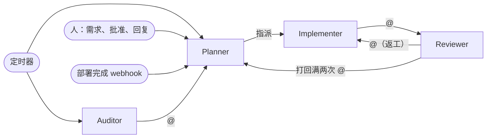

# 四个角色

| 角色 | 负责 | 不能做 | 实时触发 | 定时触发 |
|---|---|---|---|---|
| Planner | 拆需求、选人派发、线上验收、升级 | 写代码、批准任务 | 支持 | 支持 |
| Implementer | 实现单个子任务 | 评审、合并、标记完成 | 支持 | 不支持 |
| Reviewer | 评审 PR | 改代码、验收 | 支持 | 不支持 |
| Auditor | 代码健康审计、agent 成绩单 | 改代码、直接建任务 | 不需要 | 支持 |

角色指令在目标仓库的 `ops/agents/<角色>.md`，是 Multica 里 agent 指令的唯一来源：修改走 PR，合并后 `autoteam multica --apply` 同步。禁止项都带了原因，模型遵守得会好很多。

## 规则怎么变好

Planner 不只是执行流程，它还负责**让流程变好**：

```
Auditor 的四份报告 ┐
人工介入的每一次   ├→ 运营笔记（Planner 随手记）→ 规则复盘（每周）→ backlog 里的改进任务 → 人批准 → playbook / 参数 / 指令生效
Planner 自己的观察 ┘
```

衡量标准是 `health-metrics.sh` 的 `human_7d`：人自己提交和评审的次数应该随时间下降。它不降，说明规则没在变好。

## 谁会叫醒谁



Implementer 和 Reviewer 不设定时触发：它们的每次运行都要对应一个具体任务，由 Planner 统一调度。

## Planner

人只和 Planner 对话。Planner 用最强的模型，Web 项目可以挂浏览器自动化（`planner-mcp.json`）做线上验收。

- **收到需求**：读 AGENTS.md 和相关代码，不清楚先问人；父任务写能在线上验证的验收标准；拆成子任务放进 `backlog`（按依赖标批次 `--stage`，写明为什么做、不做什么），指派给自己，然后提及人请他批准。
- **人工介入后继续**：评论、补充说明、回答问题或状态变化后，先核对原任务描述和验收标准；仍成立就在原任务重新派发、返工或继续验收。建子任务前既要搜索查重，也要检查是否有可直接推进的原任务。只有目标或范围确实变化且无法在原任务继续，才新建子任务，并在描述中写明「为什么不能在原任务上继续」；首次拆分大需求的规则不变。
- **派发**：子任务被批准时会叫醒它。只派发 `approved` 且前面批次都完成的任务；按计费注册表选 Implementer 和 Reviewer（两者不同，优先不同厂商），在评论里写明理由，再指派 Implementer。
- **验收**：部署通知叫醒它，对 `shipping` 的任务逐条在线上验证、贴证据；通过设 `done`，不通过在原任务设 `rework` 并提及 Implementer，评审打回和人工反馈也回原任务处理；父任务整体验收失败回到对应原子任务返工，不另拆补充任务；线上故障先回滚再升级。
- **升级**：打回满两次、验收失败满两次、换人后仍失败时，设 `blocked` 并提及人，说明卡点、选项和建议。
- **定时**：每 2 小时推进巡检、每天 9:00 摘要、每周一 10:00 路线图对账（含不变量对账）、每周一 12:00 规则复盘。
- **记忆**：`ops/agents/playbook.md` 是人批准过的经验（每次开工必读），Multica 里的「运营笔记」任务是它自己随手记的观察。两者的区别是：前者约束行为，后者是素材。

## Implementer

可以配多个，分别用不同厂商、不同计费模式的 agent。

开工先 `make dev` 起环境、做一次端到端验证，确认项目当前是好的；交付时贴 `make check` 结果，开 PR（标题以任务编号开头、不写关闭关键字），平台闸门生效时打开自动合并（`merge-mode.sh` 判断），未命中人工 CODEOWNERS 时把任务改为 `code_review`，并提及 Planner 指定的 Reviewer。范围外的问题写进评论的“范围外发现”，不顺手做。

不要：新写已有的组件和函数（同一个 bug 会要修好几处）；加 fallback、双写、兼容层（错误会被吞掉）；大范围重构（没法评审）。

## Reviewer

可以配多个，但必须和本任务的 Implementer 是不同的 agent，最好是不同厂商的模型，避免模型评审自己的思路。

先看自动检查，有失败直接打回；只看三件事：正确性（边界、错误路径、并发）、有没有重复实现、跨服务数据有没有校验。无阻塞项就在 PR 上批准、未命中人工 CODEOWNERS 时任务改为 `shipping`（降级模式下再等检查通过后由它合并）；有阻塞项就要求修改、任务改为 `rework` 并提及 Implementer；同一个 PR 打回满两次，不再打回，提及 Planner 说明分歧。

## Auditor

只出报告，不改代码、不建任务，要做的事交给 Planner 统一拆分。

| 任务 | 默认时间 | 内容 |
|---|---|---|
| agent 成绩单 | 每周一 8:00 | 各 Implementer 的一次通过率、返工轮次、单任务花费 |
| 整合审计 | 每周一 9:00 | 重复代码占比变化、新增的重复实现 |
| 前沿扫描 | 每周一 11:00 | 模型、CLI、平台、计费规则的变化让哪条指令或参数不再适配 |
| 规格对账 | 每周五 9:00 | 任务里的验收标准和实际代码不一致的地方 |
| 老代码巡检 | 每月 1 号 3:00 | 一年没动过的模块还有没有在用 |

时间都在 `autoteam.conf` 的 `AUTOTEAM_CRON_*` 里，改完重新渲染 autopilot 再 `autoteam multica --apply`。

每条建议都要能变成一个独立的小任务，不提“整体重构”。

改动命中 PR 目标分支 CODEOWNERS 的人工负责路径时，Implementer 提 PR 后就把任务设为 `blocked`、指派给 `AUTOTEAM_HUMAN`，列出文件并提及人和 Reviewer；Reviewer 照常评审，批准后保持 `blocked` 并提醒人批准，不转 `shipping`。不命中时保持原流程。人批准并合并后回复 @Planner，由 Planner 转回 `shipping` 并验收。
