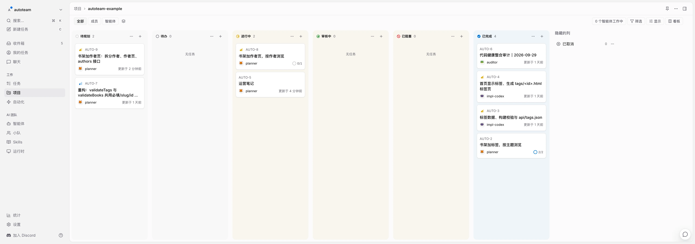
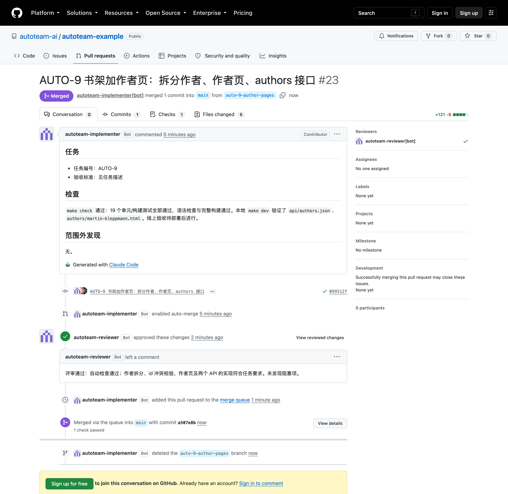
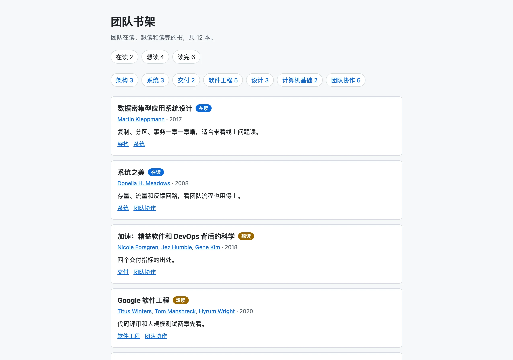
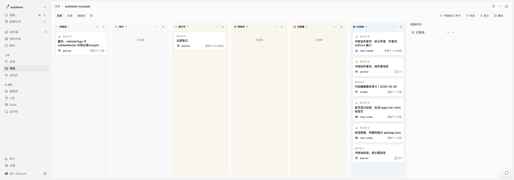

# 示例项目：团队书架

[autoteam-example](https://github.com/autoteam-ai/autoteam-example) 是 autoteam 的官方示例：一个零依赖的 Node 静态网站生成器，把 `data/books.json` 生成成书架网页和 JSON 接口，部署到 GitHub Pages（线上地址见示例仓库）。本地需要 Node 22 以上，可用 `npm test`、`npm run build`、`npm start` 测试、构建和预览。

下面的过程和截图来自 [2026-10-01 演练记录](https://github.com/autoteam-ai/autoteam-example/blob/main/e2e/runs/2026-10-01-bookshelf/README.md)：给书架加作者页，首页可以点击作者，按作者浏览书籍，并提供作者 JSON 接口。

## 四个角色各做了什么

| 角色 | 这次演练里的工作 |
|---|---|
| Planner | 把 AUTO-8 拆成子任务 AUTO-9，写明范围和线上验收标准，派发实现与评审；部署后验收子任务和父任务 |
| Implementer | 实现作者拆分、作者页和接口，运行检查，开 PR #23 并打开自动合并 |
| Reviewer | 检查实现和验收标准，用独立的 GitHub App 批准 PR，随后进入合并队列 |
| Auditor | 演练后生成健康报告，发现作者页与标签页的重复结构、验收标准遗漏；Planner 将重构建议放进待审核，并补齐标准 |

## 一次需求怎样交付

### 1. 拆分与批准

07:32:42，人提出 AUTO-8「书架加作者页，按作者浏览」。Planner 将它拆成一个子任务 AUTO-9，写清为什么做、要做什么、不做什么和验收标准，放进待审核。07:35:26，人运行 `autoteam approve AUTO-8 --apply` 批准；Planner 随后派发 Claude 实现、Codex 评审。

### 2. 实现与评审

07:37:15，Implementer 开出 [PR #23](https://github.com/autoteam-ai/autoteam-example/pull/23)，改动 5 个文件（+121 −9），打开自动合并，任务进入审核中。07:39:44，Reviewer 批准；平台通过合并队列在 07:41:50 合并。

### 3. 上线与验收

07:42:25，CI 部署成功并通知 Planner 本次上线了 AUTO-9。Planner 先核对线上 `version.json` 的 sha 是合并提交，再逐条验证作者链接、作者页和接口。07:42:56，子任务验收通过；07:43:19，父任务整体验收通过。从提需求到父任务完成约 11 分钟，人只提了需求、批准了一次。

## 自己跑一遍

按[第 7 步：跑通第一个需求](first-run.md)演练自己的小需求。要看接入配置、带时间的证据和 Auditor 报告，继续读[完整演练记录](https://github.com/autoteam-ai/autoteam-example/blob/main/e2e/runs/2026-10-01-bookshelf/README.md)。
